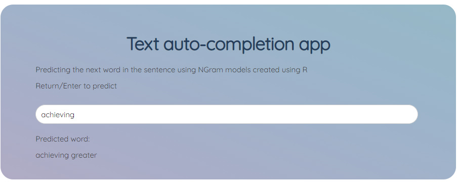

```{r setup, include=FALSE}
knitr::opts_chunk$set(echo = TRUE)
```

## Text completion project
Creating a text completion app using **NGram** modelling, which uses *bigrams*, 
*trigrams*, *tetragrams*, and *pentagram* created from various data sources:  
- News  
- Blogs  
- Twitter  

The Ngrams were created in RStudio's R environment and has been published on 
kaggle as well as Rpubs, and the application was created in python using Dash by plotly, and has
been deployed on heroku.  

Modelling   
- [Kaggle](https://www.kaggle.com/aquaregis32/text-mining-rmarkdown)  
- [Rpubs](https://rpubs.com/aquaregis32/textmining_analysisfor_autocomplete_byAR32)  
Application - [heroku app](https://text-predict-ar32.herokuapp.com/)  

***
The Ngrams were created for each of the data sources using NGramTokenizer and 
TermDocumentMatrix, which was then converted to matrix - The highest memory 
allocation required to build the matrices was 8gb during the process.

Then all the bigrams, trigrams, tetragrams and pentagrams were combined into one
dataset by indicating type of NGram they represented using the *which* field.

The dataset contains the *token*, frequency of occurance - *freq*, and the *which*

## Application Overview

The application has been built completely using python, the R function to 
predict the word was rewritten in python instead of using RScript.   

The application uses Dash by plotly to create the web app which renders html
content to any supporting browser.   

The UI is fairly simple, with only some text describing the app and an input box
It useses bootstrap-grid.css available openly, and uses NLTK, pandas, re (for
regular expression) libraries for running the code and predicting the output.

***
User can input the sentence and once entered upon pressing return, the predicted
output/predicted next word for the sentence input will be displayed right below
text input box.  



